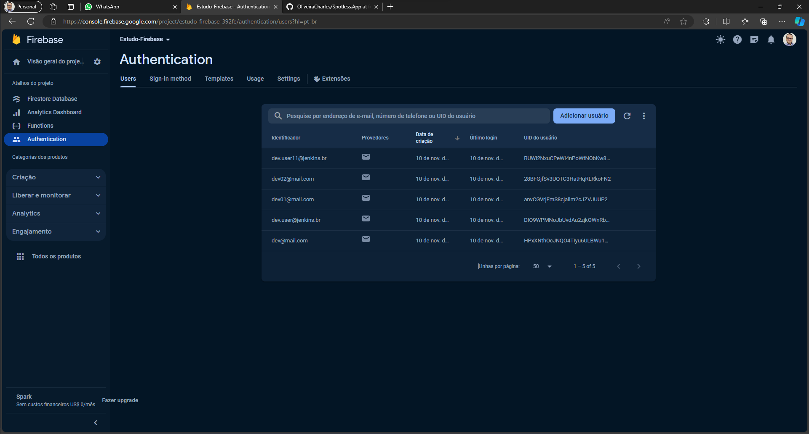
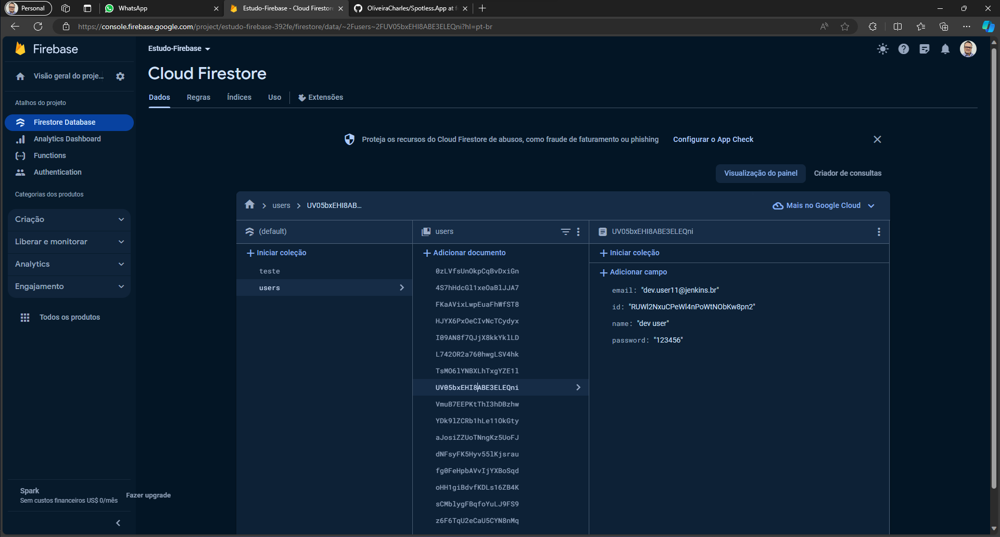

# CHANGELOG

1. **Configuração Inicial:**
   - Configuração do ambiente React Native.
   - Configuração do Redux Toolkit para gerenciamento de estado.
   - Configuração e integração do Firebase para autenticação e Firestore para armazenamento de dados.

2. **Implementação do UserSlice:**
   - Criação do slice de usuário (userSlice) utilizando o Redux Toolkit.
   - Definição de operações assíncronas para adicionar usuários e criar usuários autenticados.
   - Utilização do Firebase para autenticação e Firestore para armazenar informações do usuário.
   - Adaptação da lógica de login para funcionar com autenticação por e-mail/senha.

3. **Configuração do Store:**
   - Configuração da store Redux, combinando os reducers relacionados a usuários, filtros e pedidos.
   - Definição de tipos para `RootState` e `AppDispatch`.

4. **Páginas e Componentes:**
   - Criação de páginas como Login e ClientSign, onde os usuários podem se autenticar e se cadastrar.
   - Utilização de componentes como InputCustom, ButtonCustom, e Header para uma interface de usuário amigável.

5. **Integração com o React Navigation:**
   - Utilização do React Navigation para navegar entre as páginas.

6. **Integração com o Firebase:**
   - Configuração e inicialização do Firebase no projeto React Native.
   - Utilização do Firebase Authentication (auth) para criar usuários e permitir o login com e-mail/senha.
   
   - Utilização do Firestore (db) para armazenar dados dos usuários, como nome, e-mail e senha.
   
      > TO-DO: remover senhas em plaintext
7. **Correções de Erros:**
   - Abordagem de diversos problemas, como erros de importação, configuração do Firebase, tratamento de erros, etc.

Foram abordadas as principais etapas relacionadas à integração com o Firebase, Authentication e Firestore.
